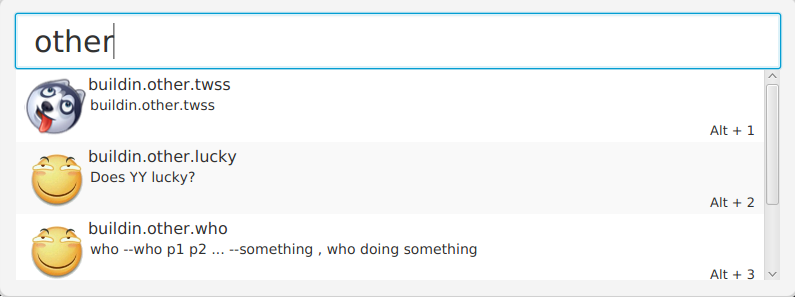

[](https://travis-ci.org/{{github-user-name}}/{{github-app-name}}.svg?branch=master)
[](http://opensource.org/licenses/MIT)

This is an middle layer of [`copilot-core`](https://www.npmjs.com/package/copilot-core) with a javafx GUI program.

# How to use
```
$npm install copilot-io -g
$copilot-io --with-jar
```

NOTE
>Java 8 is required.

# Usage
```
Options:
 --with-jar      run server with javafx GUI, java 8 is required (NOT openJDK 8) 
 --jar-alone     run javafx GUI, java 8 is required (NOT openJDK 8)             
 --port <num>    Server listen port                                             
 --help, -h      Show help message  
```

See [copilot-core](https://www.npmjs.com/package/copilot-core) for more information

# Screenshots




